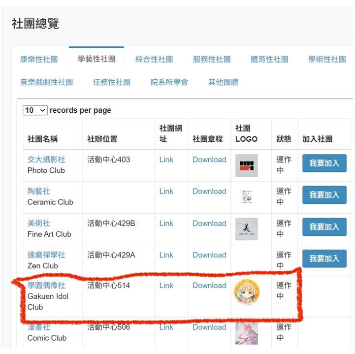

# 【社團合併公告】

國立陽明交通大學虛擬偶像社（以下簡稱 VT 社）與國立陽明交通大學動畫社（以下簡稱動畫社）經兩社社長協商後，決議於民國115年4月1日起，正式合併並改組為 **「國立陽明交通大學學園偶像社」（Gakuen Idol Club，簡稱GIL）**。

**學園偶像社將會延續 VT 社與動畫社的社員身分，已經是兩社社員的人將不需再額外繳交社費。另外，新的社團資訊與章程目前已經更新在[學園偶像社社團網站](https://gakuen-idol.nycu.cc/) ，想深入了解的社員可以前往查看。**

## **合併緣由與背景**
VTuber 社員與動畫社員們其實一直有個夢想：成為閃亮耀眼的偶像。

看著蓮ノ空女学院スクールアイドルクラブ的花帆從０開始學習唱歌跳舞，又或者是見證ホロライブ的藝人們開創出 VTuber 偶像世代，這些感動使我們對於「偶像」越發憧憬。

基於各位社員的訴求，交大 VTuber 社與交大動畫兩社在經討論後，決定合併成學園偶像社，一同努力成為交大最閃耀的新星。

雖然本想另建交大偶像學園，但因課外二組經費不夠故只能成立社團。
為了提供社員們最佳的學園偶像體驗、回應長久以來的改革呼聲，兩位社長痛定思痛，最終還是決定進行合併，冀望能為陽明交大的偶像活動帶來新氣象。

## **願景與核心發展**
學園偶像社將以「培養偶像」為願景，並推動以下四大核心計畫：

### 1. **聲優欣賞會與偶像番推坑**
### 2. **偶像選拔大賽與女裝評鑑**
### 3. **日本實地訪查與偶像研究**
### 4. **更新社辦與充實女裝衣櫥**

## **未來展望與計畫**
我們深信，學園偶像社的成立將會成為陽明交大社團史上的一大里程碑，甚至可能影響整個 ACG 次文化圈。

此外，我們計劃於開學後舉辦「**偶像新生典禮**」，屆時將邀請神秘嘉賓（可能是 YAGOO、可能是秋元康、也可能只是 PPT）進行揭幕儀式，並針對未來發展方針進行詳細說明。

## **首屆幹部徵選**
目前學園偶像社正在積極招募有志之士，無論你是喜歡製作偶像服、虛擬或真人偶像愛好者，還是對偶像文化研究有興趣的學者，都歡迎加入我們的行列。

幹部需求如下：
- **有赴日參與演唱會之經驗優先**
- **會化妝者優先**
- **擁有跳舞資質者佳**
- **會女裝可直接加入**
- **有能力搶到日本演唱會門票者享有優先待遇**（例如優先享有借用社辦練舞權）

## **更多資訊**
**若對本社團有興趣，請於時空裂縫穩定期間（每日19:00-23:00）前往本社辦公室，或透過電子郵件 GakuenIdol@nycu.edu.tw 取得聯繫。**

**想了解更多關於學園偶像社的資訊，也可以到[社團網站](https://gakuen-idol.nycu.cc/)查看。**

**另外，由於我們併社了，在學校系統上也會跟之前不太一樣。**
**目前已經跟學校那邊協調並修改完成，原本的社員可以到交大的單一入口點選加入社團，我們會再把你們加為新社團的社員。**

**最後，誠摯邀請交大 VTuber 與交大動畫社的社員，以及所有國立陽明交通大學的所有學生，一同踏入次世代的幻想之門，共同見證學園偶像社的誕生！**

——**國立陽明交通大學學園偶像社（Gakuen Idol）創社幹部「阿冬」、「企鵝」 敬啟。**

